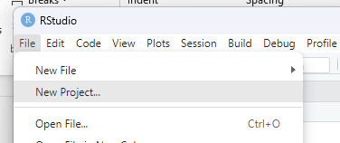
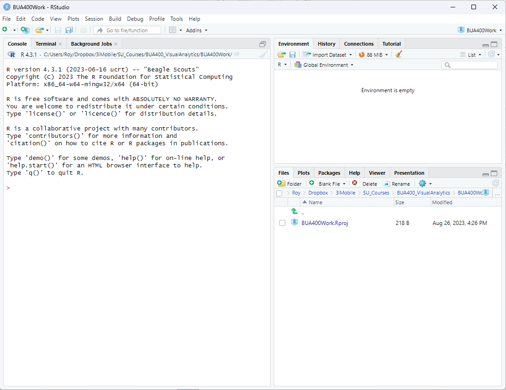

```{r setup, include=FALSE, echo=FALSE}
options(htmltools.dir.version = FALSE)
knitr::opts_chunk$set(comment = "")
```

## Agenda

--

- ####Introduction
- ####Typical Lecture
- ####Syllabus
- ####Attendance
- ####Analytics in the News
- ####Intro to Visual Analytics
- ####R Markdown
- ####OYOTs (On Your Own Tasks)


---


## Introduction

--

### What is Visual Analytics

--
<br>


.center[
</img>
]

.center[
https://www.researchgate.net/figure/Visual-analytics-as-the-interplay-between-data-analysis-visualization-and-human_fig2_333884128
]


---
<br><br><br><br>
```{r include=TRUE, echo=FALSE}
knitr::kable(
  mtcars[1:10, ], 
  caption = "A cars dataset"
)
```
---


</img>

--

</img>


--

</img>

--

</img>

--

</img>

---
## A Typical Lecture

- ####Agenda
- ####Attendance
- ####Review of past OYOTs
- ####Analytics in the News
- ####Main Lecture with hands on work
- ####Wrap up with next OYOTs

---
## Syllabus

#### [Visual Analytics Syllabus](introduction_files/Fall2023_RT_BUA400_CourseSyllabus.pdf)

---

## Attendance

#### [Attendance Sheet](a link to google sheet)

---

## Course Breakdown

- ####Some Theory on Visualizations
- ####R and ggplot
- ####Tableau
- ####Microsoft Power BI

---

## What is ggplot?

.center[
</img>
]

--

.center[
</img>
]

[//]: # "segment ends here"

---
class: middle, center

## Analytics in the News

---

## Do you have?

- ####</img>
- ####</img>


- ####Download R from here: [https://www.r-project.org/](https://www.r-project.org/)
- ####Download RStudio from here: [https://posit.co/download/rstudio-desktop/](https://posit.co/download/rstudio-desktop/)

---

## Steps to test...

Open a new empty Rmd file  
Create a "code chunk" by typing in Ctrl+Alt+i   or Cmd+Opt+i  
Inside the code chunk, type in str(mtcars)  
Execute the code chunk with Ctrl+Shift+Enter   or Cmd+Shift+Enter

```{R include=TRUE, echo=FALSE}
str(mtcars)
```

---
####Plot of mpg against disp
```{R include=TRUE, echo=FALSE}
plot(mtcars$disp,mtcars$mpg)
```

---
class: middle, center

## Markdown

---

## Markdown

--

**Input:**

.small-font[
```
This is a sentence in Markdown, containing `code`, **bold text**,
and *italics*.
```
]


--

**Output:**

.small-font[
This is a sentence in Markdown, containing `code`, **bold text**, and *italics*.
]

---

## Markdown

.pull-left[
**Input:**

.small-font[
```
## 1 Introduction

Data visualization is part art 
and part science. The challenge 
is to get the art right without
getting the science wrong and 
vice versa.
```
]]

--
.pull-right[
**Output:**

## 1 Introduction

Data visualization is part art 
and part science. The challenge 
is to get the art right without
getting the science wrong and 
vice versa.

]


.absolute-bottom-right[
Text taken from: C. O. Wilke, [Fundamentals of Data Visualization](https://clauswilke.com/dataviz/introduction.html)
]

---

## R Markdown combines Markdown and R code

--

**Input:**

.small-font[

````
The function `rnorm()` creates normal variates.
`r ''````{R}
rnorm(5) # create 5 normal variates
```
````
]

--

**Output:**

.small-font[

The function `rnorm()` creates normal variates.
```{R}
rnorm(5) # create 5 normal variates
```
]

[//]: # "segment ends here"

---
class: middle

## Running R: R, RStudio

---

## Using RStudio

.center[
</img>
]

---

## Using RStudio

.center[
</img>
]

---

## Creating a new Project Folder

.center[
</img>
]

---

## Creating a new Project Folder

.center[
</img>
]

---

## Creating a new Project Folder

.center[
</img>
]

---

## Creating a new Project Folder

.center[
</img>
]

---

## Creating a new Project Folder

.center[
</img>
]

---

## Creating a new R Markdown file

.center[
</img>
]

---

## Creating a new R Markdown file

.center[
</img>
]

---
## Creating a new R Markdown file

.center[
</img>
]
---
## Knitting to PDF

.center[
</img>
]
---
## Knitting to PDF

.center[
</img>
]

---

## Further reading

- [R Markdown tutorial](https://rmarkdown.rstudio.com/lesson-2.html)
- [R Markdown cheatsheet](https://github.com/rstudio/cheatsheets/raw/main/rmarkdown.pdf)
- [R Markdown book](https://bookdown.org/yihui/rmarkdown/)
