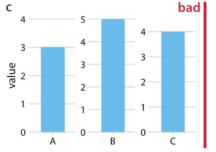
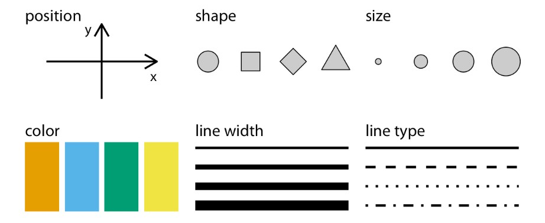
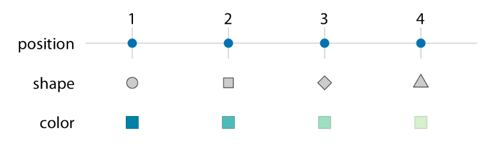

```{r setup, include=FALSE, echo=FALSE, message = FALSE}
options(htmltools.dir.version = FALSE)
knitr::opts_chunk$set(comment = "")

library(tidyverse)
library(cowplot)
library(colorspace)
library(here)

# ggplot2 settings so plots scale well for slide size 
theme_set(theme_gray(16)) # 16 for full width, 18 for half width 
update_geom_defaults("point", list(size = 2.0)) # 2 for full width, 2.5 for half width
```

---

## Simple example of what you should NOT do...

.center[
</img>
]

---

## Another example ...

.center[
</img>
]

---
## Another example ...

.center[
</img>
]

---
## Finally, a half-way decent chart...

.center[
</img>
]

---
class: center middle

## Mapping data onto aesthetics

All data visualizations map data values into quantifiable features of the resulting graphic. We refer to these features as aesthetics.

---
## Components of Graphs

.pull-left[
</img>
]
--
.pull-right[
- A critical component is the x,y position
- There could be other coordinate systems: Polar coordinates, or 3D coordinates
- All graphical elements have a shape, size and color
- Lines could have different widths, or dash-dot patterns
- Fonts: font family, font face, font size
]
---
class: center middle
## Types of Variables
---

</img>

---
class: center middle

</img>
#### Identify the Data Types
---
## Scales

.pull-left[
</img>
]
--
.pull-right[
- Mapping between data values and aesthetics values is created via scales
- A scale defines a unique mapping between data and aesthetics
- 
]
---

## Graph from Temperature Dataset

.pull-left[
</img>
]
--
.pull-right[
- Fairly standard visualization for a temperature curve
- Map temperature onto Y Axis
- Map "day of the year" to the X Axis
- Map location onto color
- Visualize these aesthetics with solid lines
]
---

## Alternate Graph from Temperature Dataset

</img>

--

- We could map Location to Y Axis
- Map Temperature to Color
- As the key variable of interest, temperature, is shown as color, we need to show sufficiently large colored areas for the color to convey useful information
- Therefore, we are using squares instead of lines, one for each month and location
- Used the Average Temperature of each month
- Month and Location are discrete (Month is ordered, while Location is not)
- As location is not ordered, we can decide the order - chose an aesthetically pleasing order - pleasant staggering of colors

---
.center[
## Graph with five scales

</img>
]
--

- Previous graphs had three scales (two positions and one color)
- This graph has 5 scales (two position scales, one color scale, one size scale, one shape scale)

---


